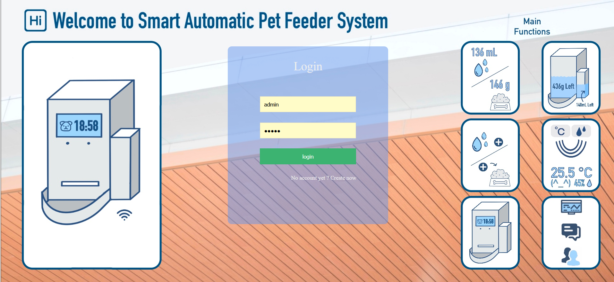
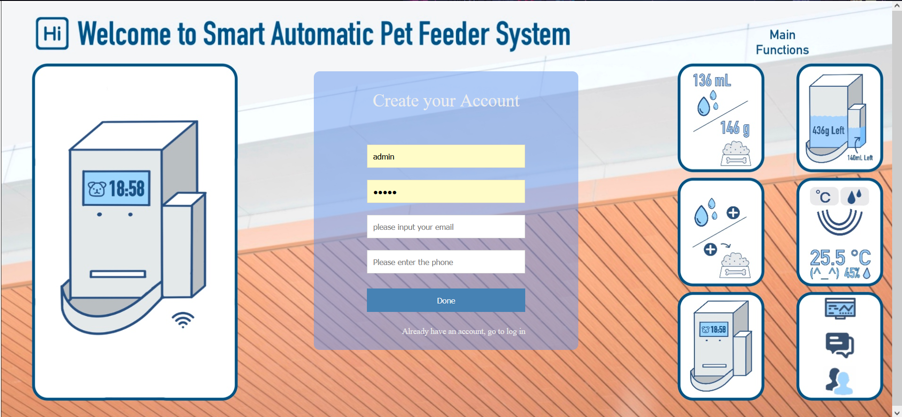
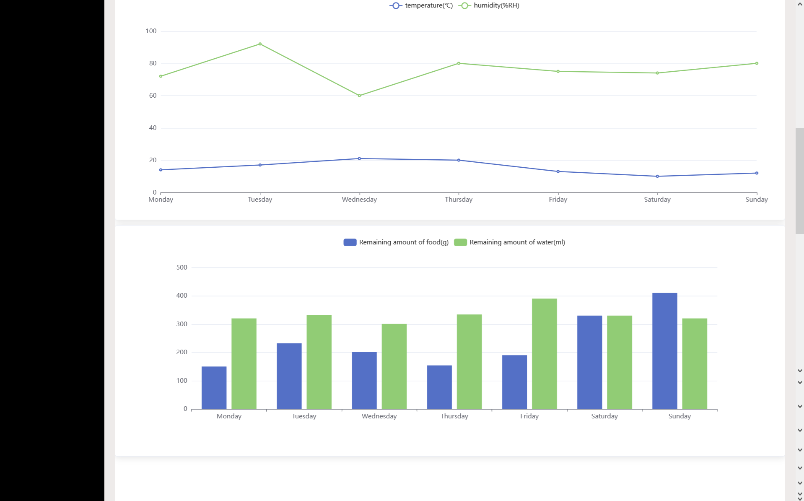
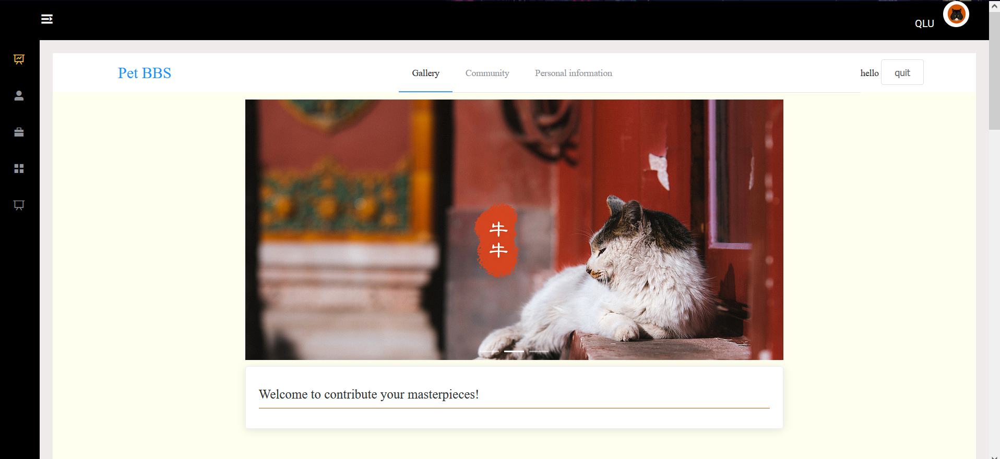
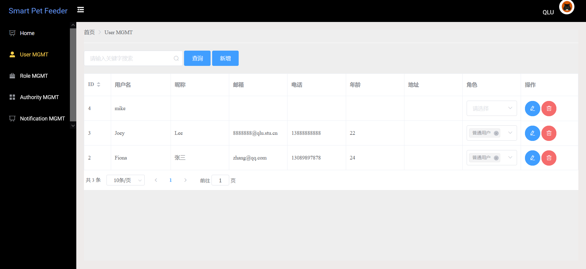
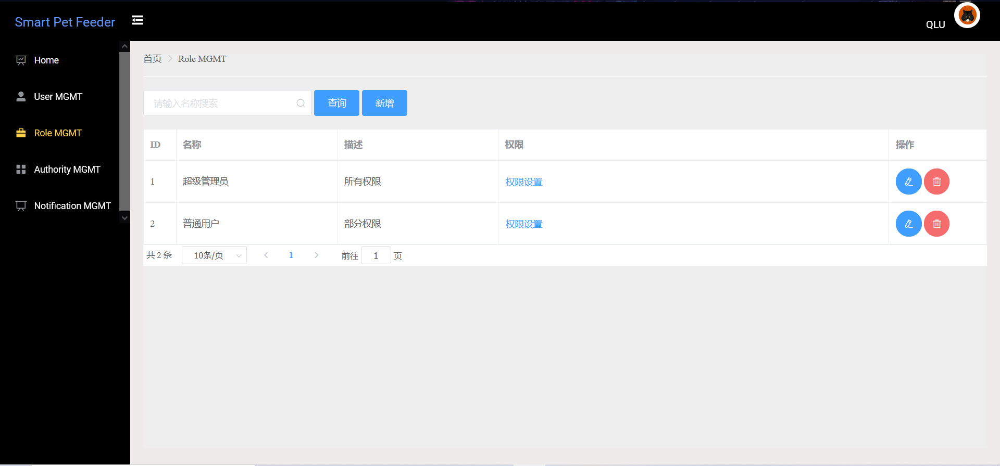

# 🚀 A Smart Automatic Pet Feeder Based on OM2M WEB

## 😺 Pet


#### 👑 Core functions
At present, the system can automatically generate `text boxes`, `drop-down boxes (with data association)`, `date controls (date and date and time controls)`, `radio buttons`, `file uploads (tables can be Display pictures directly) `etc, convenient and comfortable.


#### 🚂 Software Architecture
Java backend：SpringBoot 2.1.0 + Mybatis-plus+ hutool Toolkit+ Apache poi

Front page：Vue2.0 + ElementUI + Jquery + tinymce（Rich text plugin）

database：Mysql5.7+

**Note: JDK chooses `1.8` version, Mysql chooses `5.7` version**

The front and back ends are separated, and the page can be deployed separately, placed in the static folder of the project by default, and then accessed together with the end project.


#### 🚁 Installation tutorial

1. Use idea to open the Pet folder and import the project

2. Configure maven, download project dependencies

   

3. Create a new database pet, execute pet.sql

   
   

4. Modify the database password in application.yml

   

   

5. After the project dependencies are downloaded, run Application directly to start SpringBoot

   

6. running result  

   

#### 🛸 Instructions for use

1. Login page please visit：http://localhost:9999/page/end/login.html
2. account：admin，password：admin

#### 🎨 Screenshot of the interface

login



register



项目主页




User Interface



User MGMT



Role MGMT	



Authority MGMT


Notification MGMT


# 🐱device_main


#### 🛫 Project introduction

Project purpose : Remote intelligent pet feeding machine

A programming language : Arduino

Development board : ESP8266


#### ✨ Main functions 

- [ ] To connect to the Internet
- [ ] Get weight
- [ ] Acquisition of ultrasonic ranging
- [ ] Access to water
- [ ] Obtaining temperature and humidity
- [ ] Control of steering gear
- [ ] Control the water pump
- [ ] Upload data


#### 🛒 Library  support

```c#
<ESP8266WiFi.h>

<SimpleDHT.h>

<Timer.h>

<Servo.h>

<HX711.h>
```


#### 🚁 Develop board pins


#### 🛸 Sensors used

1. SG90

   

2. HX711

   

3. HC - SR04

   

4. DHT11

   

   

   


